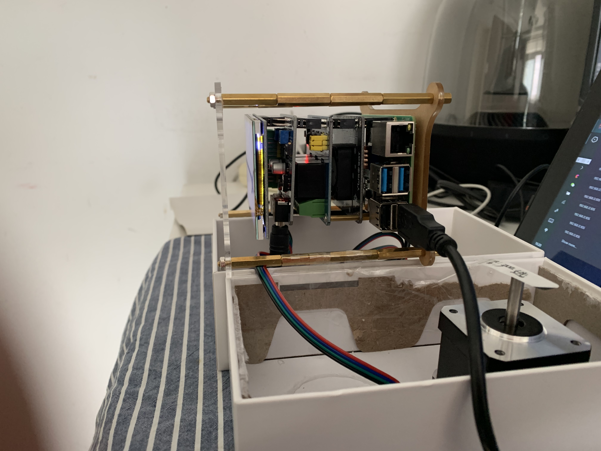

# hellopangbi

### 前言

入坑树莓派的过程中不难发现网上大多数的资料都是基于Python实现的，这难免会给一些像我这种不会Python的同学带来巨大打击。毕竟，在真实的场景中
当我们有个很好的想法时我们就想要快速的去实现它；让想法变成现实。然而，这个时候你发现落实这个想法去创造一项应用还要在去学习一门语言。也许，当你
真正的学成归来时这个想法已然不在是当初的那个想法了；也许你也将当初入坑树莓派的热情列入了放弃日志；也许你也将像大多数人一样将这块带有精妙而伟大
设计的电路板扔在某个角落里吃灰…… 

困难太多就不在一一列举了，我曾经也是上述困难池子里中的一员。但现在我已经将玩转树莓派当作是生活中必不可少的乐趣，它带来的那种“所见即所得”的即时反馈
可以瞬间让我的神经无比兴奋，我享受这样的乐趣。 

HelloPangBi是一个应用于树莓派控制硬件的Java项目。我寄托于这个项目可以把我在入坑树莓派的成长过程都记录下来。也想通过这个项目来告诉大家不要
局限于现有的资料；也许你也可以通过已有的知识体系，在树莓派“宇宙”中创造出属于你生活圈的伟大应用。 

最后，我也期待能有更多热爱树莓派的同学加入在树莓派“宇宙”中来；让当下的生活变的更好。 

### 作品橱窗
>>>>>
>>>>>
>>>>>
>>>>>
>>>>>
>>>>>
>>>>>

上述图片中展示了HelloPangBi的阶段成果。目前，它在我生活中的主要应用包括： 
1.基于中国法定节假日所定制的智能闹铃； 
2.监控当天的天气和气温(为当天的穿衣保暖做参考)； 
3.接入Siri控制LED灯(后面会通过购入的语音模块，寻找合适的ASR开源项目作自行集成); 
4.控制步进电机(为后续的行走机器人作铺垫) 

### 项目文档

####(一)硬件部分 

######1.硬件描述
HelloPangBi硬件部分目前集成内容包括：树莓派4(4G版)，散热风扇，微雪继电器模块，微雪步进电机驱动板，微雪SM24240步进电机，树莓派3.5寸LCD触摸屏；

######2.驱动说明
驱动安装部分主要是针对微雪继电器模块、微雪步进电机驱动板以及树莓派3.5寸LCD触摸屏。其中，微雪继电器模块和微雪步进电机驱动板需要安装
BCM2835和wiringPi这样我们才可以访问GPIO引脚实现控制树莓派的外接硬件。

    安装BCM2835， 打开树莓派终端，并运行以下指令
        wget http://www.airspayce.com/mikem/bcm2835/bcm2835-1.68.tar.gz
        tar zxvf bcm2835-1.68.tar.gz 
        cd bcm2835-1.68/
        sudo ./configure && sudo make && sudo make check && sudo make install
        # 更多的可以参考官网：http://www.airspayce.com/mikem/bcm2835/
        
        
    安装wiringPi
        sudo apt-get install wiringpi
        #对于树莓派2019年5月之后的系统（早于之前的可不用执行），可能需要进行升级：
        wget https://project-downloads.drogon.net/wiringpi-latest.deb
        sudo dpkg -i wiringpi-latest.deb
        gpio -v
        # 运行gpio -v会出现2.52版本，如果没有出现说明安装出错

    安装3.5 inch 的屏就直接复制下面的内容：
        cd /boot
        sudo tar zxvf LCD-show-160701.tar.gz
        cd LCD-show/
        sudo ./LCD35-show

    从3.5寸屏切换回HDMI显示
        cd /boot
        sudo tar zxvf LCD-show-160701.tar.gz
        cd LCD-show/
        sudo ./LCD-hdmi
    
    上述驱动完成安装后，最好重启一下树莓派。重启命令：sudo reboot

####(二)软件部分 

项目jar包依赖：pi4j、usb4、datecapsule.jar(自研)、json-20190722.jar、jsoup-1.12.1.jar、sqlite-jdbc-3.30.1.jar

概览(package)：

|package(包)|Description(描述)|
|---|---|
|gpio|树莓派引脚控制包(输入/输出端口)|
|lang|项目基础包|
|usb|树莓派USB控制|
|hellowindow|可视化程序及项目主入口(main方法)|

文档(documentation)：

|概览(package)|Class(名称)|Method(方法)|parameter(参数)|Modifier and Type(返回类型)|Description(描述)|
|---|---|---|---|---|---|
|gpio|StepperMotor|getOpenGPIO() |---|void|硬件接入步进电机A3A4B3B4端口，实现控制电机启动|
|gpio|StepperMotor|getShutDownGPIO() |---|void|硬件接入步进电机A3A4B3B4端口，实现控制电机关闭|
|gpio|ControlMotor|getControlMotor()|---|static void|控制步进电机的运行圈数|
|usb|HelloUSB|findDevice(short vendorId, short productId)|vendorId：供应商ID；productId：产品编号|Device|查找 USB 设备|
|usb|HelloUSB|getDeviceHandle(Device device)|device：设备|void|与具体的USB端口实现通信|
|usb|HelloUSB|getUSBPowerSupply|---|void|控制USB电源|
|lang|WeekMap|getWeek(String strWeek)|strWeek：星期一~星期天|String|返回星期一~星期天的英文翻译|
|lang|ArtTable|---|---|void|此类用于画作晴、云、多云、雨、阵雨、雪等天气图形|
|lang|SarsCovSupervisoryControl|getHangZhouSarsCovData()|---|String|(监控)返回当前杭州新冠病毒当前确认数据|
|hellowindow|TodayWeather|getTodayWeather()|---|void|展示天气图形化|
|hellowindow|TodayWeather|getTemperature()|---|String|返回当天气温数据|
|hellowindow|HelloWindow|main(String[] args)|String[] args|static void|程序运行主入口|

----
* uhubctl是用于控制智能USB集线器上每个端口的USB电源的实用程序。智能集线器定义为实现每端口电源切换的设备

    用法： 
    1.列出所有受支持的集线器：uhubctl
    2.控制USB端口的电源：uhubctl -a off -p 2
    这意味着在默认的智能集线器上运行，并关闭端口2（）的电源（-a off或）。支持的动作是/ / （或/ / ）。 表示关闭电源，等待一段时间（可通过配置），然后重新打开。端口可以​​是逗号分隔的列表，并且可以用于范围，例如，或，或，或。-a 0-p 2offoncycle012cycle-d-22,42-51-2,5-8

